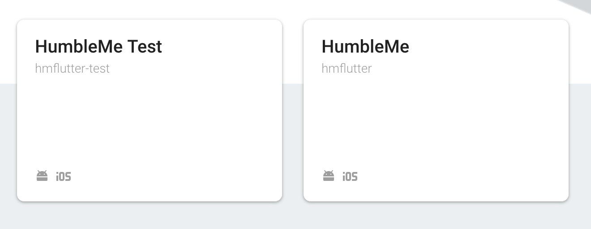

# HumbleMe [](https://opensource.org/licenses/BSD-3-Clause)

HumbleMe iOS/Android app built in Google's [Flutter](https://flutter.io/) framework which is written in the [Dart](https://www.dartlang.org/) programming language, also by Google. Check out Flutter's [Getting Started](https://flutter.io/get-started/install/) guide
to learn how to get set up with it. And read up on Dart's [syntax](https://www.dartlang.org/guides/language/language-tour) as well.

- [Getting Started](#getting-started)
- [Firebase](#firebase)
- [Customization](#customization)
- [Tests](#tests)

## Getting Started

First, clone the repository:

```bash
> git clone https://github.com/dnys1/humbleme.git
```

The `cd` into the directory and run `flutter packages get`:

```bash
> cd humbleme
> flutter packages get
Running "flutter packages get" in hmflutter...               0.5s
```

To debug, follow the steps in [Customization](#customization), then run:

```bash
> flutter run --flavor production -t lib/main.debug.dart
```

## Flavors

There are two flavors, or versions, of HumbleMe: "development" and "production". The only difference between these two is the backend the app connects to. Likewise, for each flavor, there is a "debug" and "release" version where the difference is the Flutter build mode and entry point file. Thus, there are a total of 4 versions for flutter. The integrations for running these options in VSCode are provided in the `.vscode/` folder.

In short, to run the "production debug" version, run the command `flutter run --flavor production -t lib/main.debug.dart`. To run the "production release" version, change it to `flutter run --flavor production -t lib/main.release.dart`.

## Firebase

HumbleMe uses Firebase for database management. In order to get your own working copy, you'll need a Firebase project for each of the two flavors you want to use. This allows you to have a production and test environment where you can test features that require the database seperately without disturbing the release version. For example, my Firebase console looks like this:



To deploy the Firebase projects, make sure you have the [Firebase CLI](https://github.com/firebase/firebase-tools) installed and run the following code:

```sh
> cd firebase
> cd functions && npm i && cd ..
> firebase login
> firebase use --add
> firebase deploy
```

HumbleMe uses Firestore, Firebase Storage, and Functions. Consult the [Firebase documentation](https://firebase.google.com/docs/) for getting started with these.

## Customization

The following files need to be modified in order to run your own copy.

- `android/app/build.gradle`: Add your unique application ID on line `40`.
- `ios/Runner/Info.plist`: For `production` verison, add your unique application ID and Firebase URL schemes (example below).
- `ios/Runner/development/Info.plist`: For `development` version, add your unique application ID and Firebase URL schemes (example below).

Example Firebase URL scheme:

```plist
<key>CFBundleURLTypes</key>
<array>
        <dict>
                <key>CFBundleTypeRole</key>
                <string>Editor</string>
                <key>CFBundleURLSchemes</key>
                <array>
                        <string>com.humbleme.humblemeiOS</string>
                        <string>com.googleusercontent.apps.123456789123-ab4cd5efgh1ij31j6klmnop7qrstu1w</string>
                </array>
        </dict>
</array>
```

The following files need to be added:

- `android/app/src/production/google-services.json`: If building `production` version of app. File is provided by Firebase.
- `android/app/src/development/google-services.json`: If building `development` version of app. File is provided by Firebase.
- `ios/Runner/GoogleService-Info.plist`: If developing on iOS and building `production` version of app. File is provided by Firebase.
- `ios/Runner/development/GoogleService-Info.plist`: If developing on iOS and building `development` version of app. File is provided by Firebase.

## Tests

There are no tests 😳
